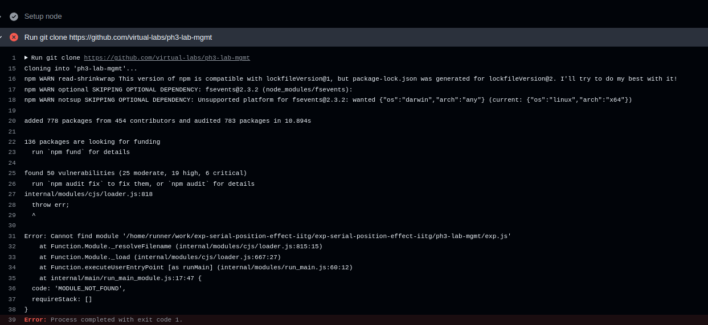

# Virtual Labs GitHub Deployment: Troubleshooting and Best Practices

## Introduction
Errors during code pushes to GitHub repositories from the dev branch to testing branch for Virtual Labs experiments can disrupt the deployment process. This document outlines common issues, troubleshooting steps, and best practices to resolve them efficiently.

## Motivation
Leveraging CI/CD pipelines to deploy experiments to GitHub Pages enhances developers' productivity and instills confidence in releases by automating testing and deployment processes.

## Prerequisites
Before proceeding, ensure you have:
- A GitHub account with access to the [Virtual Labs GitHub Organisation](https://github.com/virtual-labs).
- Familiarity with the Virtual Labs deployment process.
- Basic knowledge of JSON syntax for troubleshooting configuration files.

## Target Audience
This guide is intended for Developers, Systems Engineers, DevOps Engineers, and other team members developing experiments and managing CI/CD pipelines for Virtual Labs. It assumes a foundational understanding of CI/CD workflows.

---

## Troubleshooting Experiment Deployment Scripts
This section discusses common issues, solutions, and best practices for managing GitHub Actions used to deploy experiments to GitHub Pages.

### Why are github virtual lab experiment link not working as expected?
Potential reasons include:
- **Json file**: The JSON files of the experiment may contain errors or be invalid. Validate the JSON files using jsonlint.com or a similar tool to ensure correctness.
- **Renaming/adding of files**: In GitHub, if a file is added or renamed in the repository, the experiment repository on the gh-pages branch may create a new directory within it and move all the files there. This behavior can lead to issues with file paths and experiment link. Ensure proper handling of file additions or renaming to maintain the repository structure. 
- **Github setup**: Navigate to GitHub Settings → Build and Deployment → Ensure that the Branch is set to gh-pages. If the setting is different then the experiment link will not work. 
- **Error Logs**: Check the GitHub Actions logs for detailed error messages. These logs can provide insights into issues during the build or deployment process.

---

### How to Check Error Logs in GitHub while pushing the code from dev branch to testing branch?
1. Open your GitHub repository's main page
2. In the top navigation bar, click on the "Actions" tab.
3. This will take you to the GitHub Actions page, where you can view workflows, logs, and any running or completed actions.
4. Identify the workflow associated with the recent deployment or changes.
5. Click on the workflow run to view its details.
6. Expand the relevant job or step to inspect error logs.

---

### Common Issues and Solutions

#### 1) GitHub Pages site is not loading or displaying properly.

- **Problem**:  
  The site is inaccessible or not rendering as expected.

- **Root Cause**:  
  Misconfiguration of GitHub Pages settings.

- **Solution**:  
  1. **Verify GitHub Pages setup**:  
     Navigate to the repository's **Settings** > **Pages** section. Ensure the correct branch (e.g., `gh-pages`) is selected and published.
  2. **Check Publication Status**:  
     Confirm the site is live with a message like: _"Your site is published at [experiment site URL]."_

- **Post-Fix Verification**:  
  Access the published URL to confirm the site works as expected.

---

#### 2) Build process exits with error code 128.

- **Problem**:  
  Unexpected exit during the build process.

- **Root Cause**:  
  Extra files outside the designated simulation folder. While building the experiment some of the files may be added in the repository.

- **Solution**:  
  1. Inspect the repository for unnecessary files.
  2. Move required files to the simulation folder or remove unneeded files.
  3. add the following in the .gitignore file.
```
     node_modules/
     package.json
     package-lock.json
     build/
     DS_Store
```
  5. Re-run the build process.

- **Post-Fix Verification**:  
  Ensure the build completes without errors.

---

#### 3) "404" error when accessing a Virtual Labs experiment.

- **Problem**:  
  The experiment URL returns a "404" error after a code push.

- **Root Cause**:  
  * Misconfiguration of the deploy branch or build errors.
  * A common build error involves an invalid JSON file. While GitHub Actions might show the process as completed, JSON compatibility errors won't halt the build. As a result, the repository may create a subfolder and push all files into it, leading to a broken experiment link.

- **Solution**:  
  1. Verify the deploy branch is set to `gh-pages`.
  2. Check the `gh-pages` branch for the experiment folder.
  3. Resolve any build errors in GitHub Actions. For json file validity :
        - Validate JSON files using [jsonlint.com](http://jsonlint.com/).
        - Fix JSON syntax errors using guidance from [this documentation](https://github.com/virtual-labs/ph3-lab-mgmt/blob/master/docs/quiz.md).

- **Post-Fix Verification**:  
  Access the experiment URL to confirm the issue is resolved.

---

#### 4) Pipeline worked in the last iteration but fails in the current one.

- **Problem**:  
  Pipeline failures, often due to syntax errors in JSON files.

- **Solution**:  
  1. Check and validate JSON files using a JSON validator.
  2. Review workflow configurations for syntax issues.

- **Post-Fix Verification**:  
  Fix errors and re-run the pipeline.

---

#### 5) "Cannot find module '.../experiment-descriptor.json'" error during the build process.

- **Problem**:  
  Missing or incorrect `experiment-descriptor.json` file.

- **Solution**:  
  1. Verify the file exists and is referenced correctly.
  2. Update tags and paths in the configuration.

- **Post-Fix Verification**:  
  Re-run the build process to ensure successful deployment.

---

#### 6) "MaxListenersExceededWarning" error during the lab build process.

- **Problem**:  
  Build halts due to too many event listeners being created.

- **Root Cause**:  
  Missing files or directories in one of the experiments.

- **Solution**:  
  1. Identify the problematic experiment from logs.
  2. Add any missing files or directories.

- **Post-Fix Verification**:  
  Re-run the build process to ensure completion.

---

#### 7) Merging of the code from dev to testing branch failed with error code 1.

- **Problem**:  
  While merging code from dev to testing the build process failed with error exit code 1.

- **Root Cause**:  
 The repository might be using an outdated deployment script if it was created several years ago. This outdated script may not properly reference or include the required module (exp.js) and is likely incompatible with the current deployment environment or standards, leading to the MODULE_NOT_FOUND error.



- **Solution**:  
  1. Please replace the deployment script in the repository with latest deployment script is avaiable [here](https://github.com/virtual-labs/ph3-exp-template/blob/main/.github/workflows/deployment-script.yml).
  2. Update the deployment script in the repo and try to merge code again.

- **Post-Fix Verification**:  
  Ensure the merge completes without errors.

## Lessons Learned
- Maintain consistency in tags and file structures.
- Validate JSON files before pushing code.
- Regularly monitor GitHub Actions logs to identify and resolve issues early.
- Avoid renaming critical files like `index.html`.

By following these steps, you can streamline the deployment of Virtual Labs experiments and minimize disruptions during the build and deployment process.
